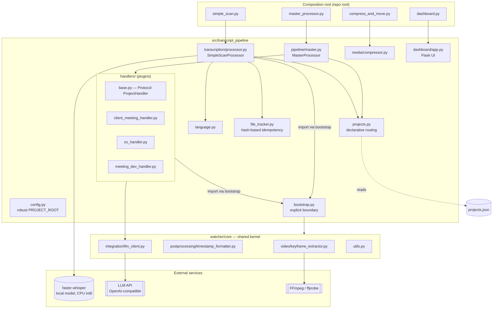

# transcript-pipeline

Local audio/video transcription pipeline (`faster-whisper`, CPU int8) with **declarative per-project routing**: every meeting, interview, or tutorial gets transcribed, routed, and summarized automatically based on rules in `projects.json` — no code changes needed to add a new project.

Daily flow: drop files into `audio/`, `Videos/`, or `Video_compress/` → `RUN_MAX_QUALITY.bat` → `.txt` + metadata + (optional) LLM summary + keyframes in `CarpetaTranscripciones/`.

## Architecture



**Composition root** (`master_processor.py`, `simple_scan.py`, `compress_and_move.py`, `dashboard.py`): thin scripts at the repo root, invoked directly by `RUN_MAX_QUALITY.bat`. They contain no logic — they just import and run the package installed in editable mode. This lets the internals be restructured without ever touching the `.bat` that runs daily.

**`transcript_pipeline`** (`src/`): the actual package. `config.py` resolves the project root by searching upward for `pyproject.toml` (doesn't assume cwd or the location of the file being executed). `file_tracker.py` gives content-hash idempotency. `projects.py` implements declarative routing. `handlers/` are interchangeable plugins behind a `Protocol`.

**Handlers as plugins, not if/else.** `MasterProcessor` doesn't know which projects exist: `projects.json` declares match rules (prefix, folder, keyword) and which handler + `output_path` to use. Adding a new project is a JSON entry, not a code branch — see [Extending the system](#extending-the-system).

**`watcher/core` as a documented shared kernel.** The pipeline reuses keyframe extraction, timestamp formatting, and a provider-agnostic LLM client that live in `watcher/` (a larger stack, with Docker/Postgres/Redis, that **doesn't** run in the daily flow — see [Known limitations](#known-limitations)). Instead of every module inserting its own `sys.path` hack, `bootstrap.py` is the single point that exposes that boundary.

## Tech stack

| Component | Purpose |
|---|---|
| [faster-whisper](https://github.com/SYSTRAN/faster-whisper) (CTranslate2) | Local transcription, CPU, `compute_type=int8`, beam search (`beam_size=10`, `best_of=5`) + VAD |
| Flask | Local dashboard: file browser, transcription editor, pipeline runner |
| FFmpeg / ffprobe | H.265 compression, keyframe extraction, video stream detection |
| pytesseract + Pillow/imagehash | Content diff between frames (OCR or perceptual hash) for dev meetings |
| MarkItDown | Converts attached PDF/Word/Excel/images to Markdown for meeting context |
| Provider-agnostic LLM client (`watcher/core/integration/llm_client.py`) | Summaries and screen analysis via any OpenAI-compatible `/v1/chat/completions` endpoint (OpenAI, DeepSeek, Ollama, LM Studio) |
| python-dotenv | Configuration via `scan_config.env` |
| pytest | Unit test suite |
| setuptools (src-layout) | Packaging, `pip install -e .`, entry points |

## Design decisions

- **Idempotency without an external database** (`file_tracker.py`): hash of `size + mtime + first 8KB` of the file, not the whole file — cheap even for large videos. Avoids reprocessing and detects transcriptions that already exist on disk as a fallback.
- **Declarative routing** (`projects.json`): language, Whisper initial prompt, summary prompt, domain-specific vocabulary corrections, and filler words to strip — all per project, without shipping code.
- **Robust root resolution**: `config.PROJECT_ROOT` searches upward for `pyproject.toml` instead of assuming `Path(__file__).parent` (would break once the code lives inside `src/...`) or depending on the cwd the script was launched from.
- **Explicit boundary to the shared kernel** (`bootstrap.py`): a single documented point that adds the repo root to `sys.path` to import `watcher.core.*`, instead of every module repeating its own hack.
- **Handler contract via `typing.Protocol`** (`handlers/base.py`): the pipeline programs against an interface, not concrete classes — adding a new handler doesn't require touching `MasterProcessor`.

## Project structure

```
whisper/
├── pyproject.toml                 # dependencies, entry points, src-layout
├── RUN_MAX_QUALITY.bat            # daily entrypoint (compress + organize + transcribe)
├── projects.json.example          # declarative routing template (real projects.json is gitignored)
├── scan_config.env(.example)      # runtime configuration
├── master_processor.py            # composition root
├── simple_scan.py                 # composition root
├── compress_and_move.py           # composition root
├── dashboard.py                   # composition root
├── src/transcript_pipeline/
│   ├── config.py / bootstrap.py
│   ├── file_tracker.py / projects.py / language.py
│   ├── transcription/processor.py   # SimpleScanProcessor
│   ├── pipeline/master.py           # MasterProcessor
│   ├── media/compressor.py
│   ├── handlers/                    # per-project plugins
│   └── dashboard/                   # Flask + templates
├── tests/                          # unit tests (pytest) + tests/e2e (Playwright)
├── docs/screenshots/               # dashboard screenshots
├── watcher/                        # shared kernel + experimental Docker stack (see Limitations)
├── deepseek/                       # standalone summarization microservice (Docker)
├── audio/ Videos/ Video_compress/  # inputs (gitignored)
└── CarpetaTranscripciones/         # outputs (gitignored)
```

## Installation

Requires Python 3.10+, [FFmpeg](https://ffmpeg.org/) on the `PATH`, and optionally [Tesseract OCR](https://github.com/tesseract-ocr/tesseract) for screen analysis in dev meetings.

```bash
pip install -e ".[dev]"
cp scan_config.env.example scan_config.env
cp projects.json.example projects.json
```

Installs the package in editable mode — `master_processor.py`, `simple_scan.py`, etc. import the code in `src/` directly, no reinstall needed after each change. `scan_config.env` and `projects.json` are local (gitignored) since they usually contain real paths and project names.

## Configuration

**`scan_config.env`** (copy from `scan_config.env.example`): input paths (Icecream Screen Recorder), keyframe extraction method, `smart_scene` thresholds, Whisper model, LLM endpoint.

**`projects.json`** (copy from `projects.json.example`): one entry per project. Example:

```json
{
  "name": "Northwind",
  "match": { "folder_contains": ["py_northwind"], "prefix": ["northwind_"] },
  "output_path": "C:/Dev/ClientProjects/Northwind",
  "handler": "client_meeting",
  "language": "en",
  "initial_prompt": "Meeting of the Northwind development team...",
  "summary_prompt": "You are an executive assistant... extract: 1. Assigned tasks...",
  "corrections": { "Samm": "Sam" }
}
```

`match` decides which files belong to a project; `initial_prompt` reduces Whisper hallucinations with domain vocabulary; `corrections` fixes recurring transcription errors (proper names, technical jargon).

## Usage

```bash
# Full daily flow (H.265 compression + organization + transcription + routing)
RUN_MAX_QUALITY.bat

# Transcription only, no per-project routing
python simple_scan.py

# Local dashboard: file browser, transcription editor, RUN button
python dashboard.py
# → http://localhost:5000
```

| Home | Preview + Insights | Transcript search |
|---|---|---|
|  |  |  |

| Extracted frames | Edit transcription | Projects (CRUD) |
|---|---|---|
|  |  |  |

| Logs | User guide |
|---|---|
|  |  |

*Screenshots use 100% synthetic data (`docs/assets/generate_mock_data.py`) — no real client file, name, or transcription appears here.*

## Testing

```bash
pytest tests/ -v
```

Covers declarative routing (`test_projects.py`), language detection (`test_language.py`), and `FileTracker` idempotency (`test_file_tracker.py`) — all pure/isolated, no Whisper model or FFmpeg required. `tests/e2e/smoke_dashboard.py` is a Playwright smoke test against a running dashboard (not part of the `pytest` run).

## Extending the system

Adding a new project doesn't require touching `MasterProcessor` or `SimpleScanProcessor`:

1. Add an entry to `projects.json` with the `match` rules and (optionally) `output_path`.
2. If it needs its own post-processing (templates, folder structure), create a handler that satisfies `transcript_pipeline.handlers.base.ProjectHandler` and register it in `HANDLER_MAP` (`pipeline/master.py`).
3. Without a handler, the file is still transcribed and routed — it just skips the post-processing logic.

## Known limitations

- **CPU-only by design** (`compute_type=int8`): a cost decision, not an architectural one — runs on any machine without a dedicated GPU, at the cost of speed compared to GPU inference.
- **`watcher/` ships a more ambitious stack** (PostgreSQL, Redis, its own Flask dashboard, diarization, forced alignment, review queue) that is **not** integrated into the daily flow — only 4 specific modules (`core/utils.py`, `core/video/keyframe_extractor.py`, `core/postprocessing/timestamp_formatter.py`, `core/integration/llm_client.py`) are reused as a shared kernel.
- **Single-machine**: no distributed queue or workers — designed for local processing, not multi-user scale.
- Whisper's `large-v3` model is downloaded (~3GB) on first use.

## License

[MIT](LICENSE)
