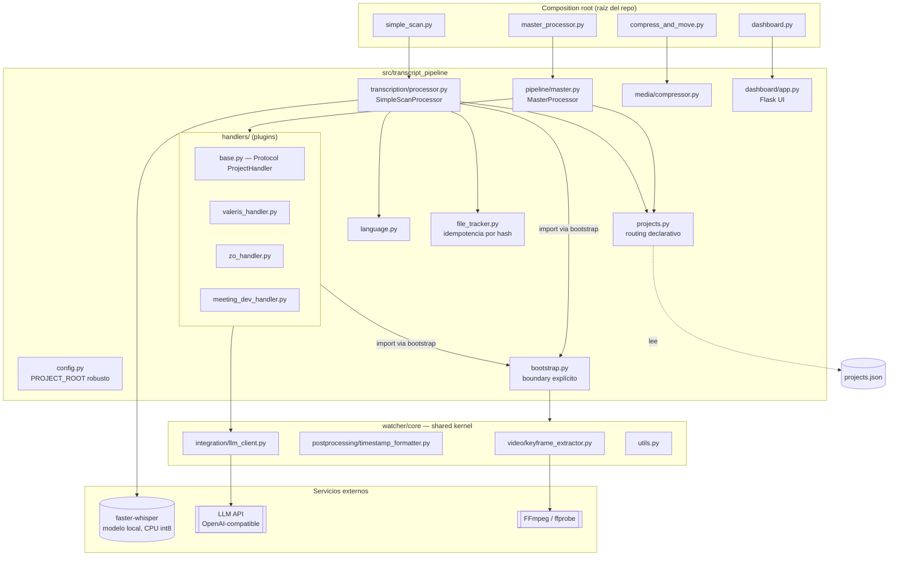
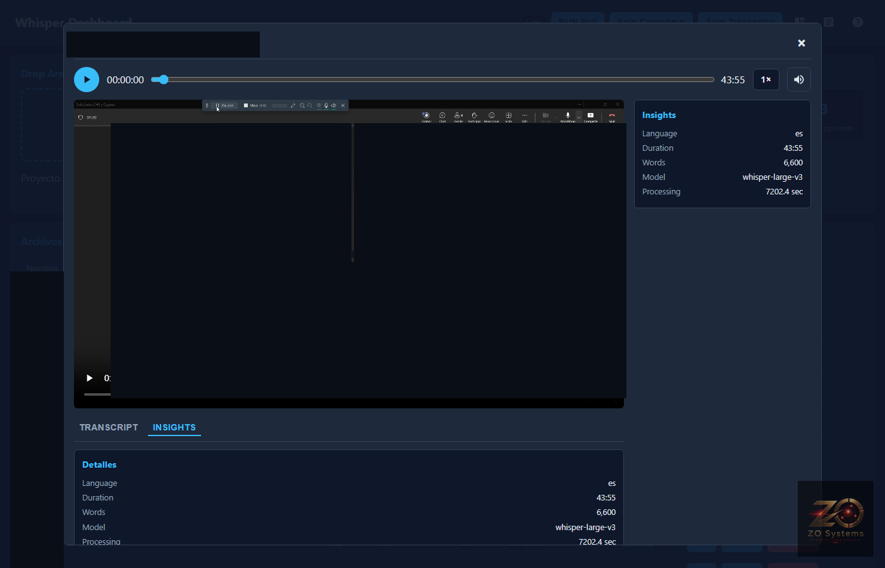

# transcript-pipeline

Pipeline local de transcripción de audio/video (`faster-whisper`, CPU int8) con **routing declarativo por proyecto**: cada reunión, entrevista o tutorial se transcribe, se enruta y se resume automáticamente según reglas en `projects.json` — sin tocar código para agregar un proyecto nuevo.

Flujo diario: soltar archivos en `audio/`, `Videos/` o `Video_compress/` → `RUN_MAX_QUALITY.bat` → `.txt` + metadata + (opcional) resumen LLM + keyframes en `CarpetaTranscripciones/`.

## Arquitectura



**Composition root** (`master_processor.py`, `simple_scan.py`, `compress_and_move.py`, `dashboard.py`): scripts delgados en la raíz, invocados directamente por `RUN_MAX_QUALITY.bat`. No contienen lógica — solo importan y ejecutan el paquete instalado en modo editable. Esto permite reestructurar todo el código interno sin tocar el `.bat` que corre a diario.

**`transcript_pipeline`** (`src/`): el paquete real. `config.py` resuelve la raíz del proyecto buscando `pyproject.toml` hacia arriba (no asume cwd ni la ubicación del archivo que se ejecuta). `file_tracker.py` da idempotencia vía hash de contenido. `projects.py` implementa el routing declarativo. `handlers/` son plugins intercambiables detrás de un `Protocol`.

**Handlers como plugins, no if/else.** `MasterProcessor` no sabe qué proyectos existen: `projects.json` declara reglas de match (prefijo, carpeta, palabra clave) y qué handler + `output_path` usar. Agregar un proyecto nuevo es una entrada JSON, no una rama de código — ver [Extender el sistema](#extender-el-sistema).

**`watcher/core` como shared kernel documentado.** El pipeline reutiliza extracción de keyframes, formateo de timestamps y un cliente LLM agnóstico de proveedor que viven en `watcher/` (un stack más grande, con Docker/Postgres/Redis, que **no** corre en el flujo diario — ver [Limitaciones](#limitaciones-conocidas)). En vez de que cada módulo inserte su propio hack de `sys.path`, `bootstrap.py` es el único punto que expone ese boundary.

## Stack tecnológico

| Componente | Uso |
|---|---|
| [faster-whisper](https://github.com/SYSTRAN/faster-whisper) (CTranslate2) | Transcripción local, CPU, `compute_type=int8`, beam search (`beam_size=10`, `best_of=5`) + VAD |
| Flask | Dashboard local: explorador de archivos, editor de transcripciones, ejecución del pipeline |
| FFmpeg / ffprobe | Compresión H.265, extracción de keyframes, detección de streams de video |
| pytesseract + Pillow/imagehash | Diff de contenido entre frames (OCR o hash perceptual) para juntas de desarrollo |
| MarkItDown | Convierte PDF/Word/Excel/imágenes adjuntos a Markdown para el contexto de la junta |
| Cliente LLM agnóstico (`watcher/core/integration/llm_client.py`) | Resúmenes y análisis de pantalla vía cualquier endpoint `/v1/chat/completions` compatible con OpenAI (OpenAI, DeepSeek, Ollama, LM Studio) |
| python-dotenv | Configuración vía `scan_config.env` |
| pytest | Suite de tests unitarios |
| setuptools (src-layout) | Empaquetado, `pip install -e .`, entry points |

## Decisiones de diseño

- **Idempotencia sin base de datos externa** (`file_tracker.py`): hash de `tamaño + mtime + primeros 8KB` del archivo, no el archivo completo — barato incluso con videos grandes. Evita reprocesar y detecta transcripciones ya existentes en disco como fallback.
- **Routing declarativo** (`projects.json`): idioma, prompt inicial de Whisper, prompt de resumen, correcciones de vocabulario específicas y muletillas a limpiar, todo por proyecto, sin desplegar código.
- **Resolución de root robusta**: `config.PROJECT_ROOT` busca `pyproject.toml` hacia arriba en vez de asumir `Path(__file__).parent` (se rompería en cuanto el código vive dentro de `src/...`) o depender del cwd desde el que se lanza el script.
- **Boundary explícito hacia el shared kernel** (`bootstrap.py`): un único punto documentado que agrega la raíz del repo a `sys.path` para poder importar `watcher.core.*`, en vez de que cada módulo repita su propio hack.
- **Contrato de handlers vía `typing.Protocol`** (`handlers/base.py`): el pipeline programa contra una interfaz, no contra clases concretas — agregar un handler nuevo no requiere tocar `MasterProcessor`.

## Estructura del proyecto

```
whisper/
├── pyproject.toml                 # dependencias, entry points, src-layout
├── RUN_MAX_QUALITY.bat            # entrypoint diario (compress + organize + transcribe)
├── projects.json.example          # plantilla de routing declarativo (projects.json real es gitignored)
├── scan_config.env(.example)      # configuración runtime
├── master_processor.py            # composition root
├── simple_scan.py                 # composition root
├── compress_and_move.py           # composition root
├── dashboard.py                   # composition root
├── src/transcript_pipeline/
│   ├── config.py / bootstrap.py
│   ├── file_tracker.py / projects.py / language.py
│   ├── transcription/processor.py   # SimpleScanProcessor
│   ├── pipeline/master.py           # MasterProcessor
│   ├── media/compressor.py
│   ├── handlers/                    # plugins por proyecto
│   └── dashboard/                   # Flask + templates
├── tests/                          # unit tests (pytest) + tests/e2e (Playwright)
├── docs/screenshots/               # capturas del dashboard
├── watcher/                        # shared kernel + stack Docker experimental (ver Limitaciones)
├── deepseek/                       # microservicio de resúmenes independiente (Docker)
├── audio/ Videos/ Video_compress/  # entradas (gitignored)
└── CarpetaTranscripciones/         # salidas (gitignored)
```

## Instalación

Requiere Python 3.10+, [FFmpeg](https://ffmpeg.org/) en el `PATH`, y opcionalmente [Tesseract OCR](https://github.com/tesseract-ocr/tesseract) para el análisis de pantallas en juntas.

```bash
pip install -e ".[dev]"
cp scan_config.env.example scan_config.env
cp projects.json.example projects.json
```

Instala el paquete en modo editable — `master_processor.py`, `simple_scan.py`, etc. importan directamente el código en `src/`, sin necesidad de reinstalar tras cada cambio. `scan_config.env` y `projects.json` son locales (gitignored) porque suelen tener rutas y nombres de proyectos reales.

## Configuración

**`scan_config.env`** (copiar desde `scan_config.env.example`): rutas de entrada (Icecream Screen Recorder), método de extracción de keyframes, umbrales de `smart_scene`, modelo Whisper, endpoint LLM.

**`projects.json`** (copiar desde `projects.json.example`): una entrada por proyecto. Ejemplo:

```json
{
  "name": "Northwind",
  "match": { "folder_contains": ["py_northwind"], "prefix": ["northwind_"] },
  "output_path": "C:/Dev/ClientProjects/Northwind",
  "handler": "valeris",
  "language": "en",
  "initial_prompt": "Meeting of the Northwind development team...",
  "summary_prompt": "You are an executive assistant... extract: 1. Assigned tasks...",
  "corrections": { "Samm": "Sam" }
}
```

`match` decide qué archivos entran por proyecto; `initial_prompt` reduce alucinaciones de Whisper con vocabulario de dominio; `corrections` arregla errores recurrentes de transcripción (nombres propios, jerga técnica).

## Uso

```bash
# Flujo diario completo (compresión H.265 + organización + transcripción + routing)
RUN_MAX_QUALITY.bat

# Solo transcripción, sin routing por proyecto
python simple_scan.py

# Dashboard local: explorador de archivos, editor de transcripciones, botón RUN
python dashboard.py
# → http://localhost:5000
```

| Home | Editor de transcripción | Insights |
|---|---|---|
|  |  |  |

| Proyectos (CRUD) | Logs | Guía de uso |
|---|---|---|
|  |  |  |

*Nombres de archivos y participantes redactados — son datos reales de proyectos de clientes.*

## Testing

```bash
pytest tests/ -v
```

Cubre routing declarativo (`test_projects.py`), detección de idioma (`test_language.py`) e idempotencia del `FileTracker` (`test_file_tracker.py`) — todo puro/aislado, sin requerir el modelo Whisper ni FFmpeg. `tests/e2e/smoke_dashboard.py` es un smoke test con Playwright contra un dashboard corriendo (no forma parte de `pytest`).

## Extender el sistema

Agregar un proyecto nuevo no requiere tocar `MasterProcessor` ni `SimpleScanProcessor`:

1. Agregar una entrada en `projects.json` con las reglas de `match` y (opcional) `output_path`.
2. Si necesita post-procesamiento propio (plantillas, estructura de carpetas), crear un handler que cumpla `transcript_pipeline.handlers.base.ProjectHandler` y registrarlo en `HANDLER_MAP` (`pipeline/master.py`).
3. Sin handler, el archivo igual se transcribe y se enruta — solo no corre la lógica de post-procesamiento.

## Limitaciones conocidas

- **CPU-only por diseño** (`compute_type=int8`): decisión de costo, no de arquitectura — corre en cualquier máquina sin GPU dedicada, a costa de velocidad frente a inferencia en GPU.
- **`watcher/` trae un stack más ambicioso** (PostgreSQL, Redis, dashboard Flask propio, diarización, forced alignment, cola de revisión) que **no** está integrado al flujo diario — solo se reutilizan 4 módulos puntuales (`core/utils.py`, `core/video/keyframe_extractor.py`, `core/postprocessing/timestamp_formatter.py`, `core/integration/llm_client.py`) como shared kernel.
- **Single-machine**: sin cola distribuida ni workers — pensado para procesamiento local, no para escala multi-usuario.
- El modelo `large-v3` de Whisper se descarga (~3GB) en el primer uso.

## Licencia

[MIT](LICENSE)
