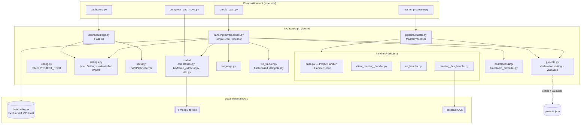
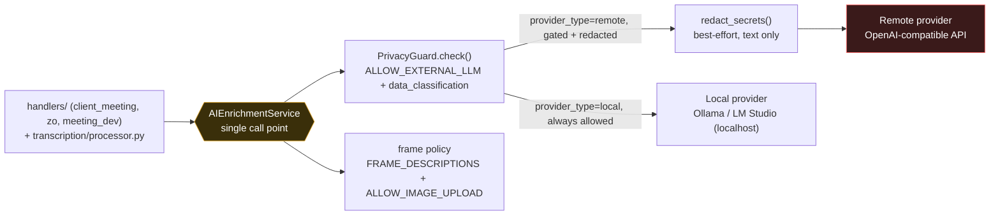
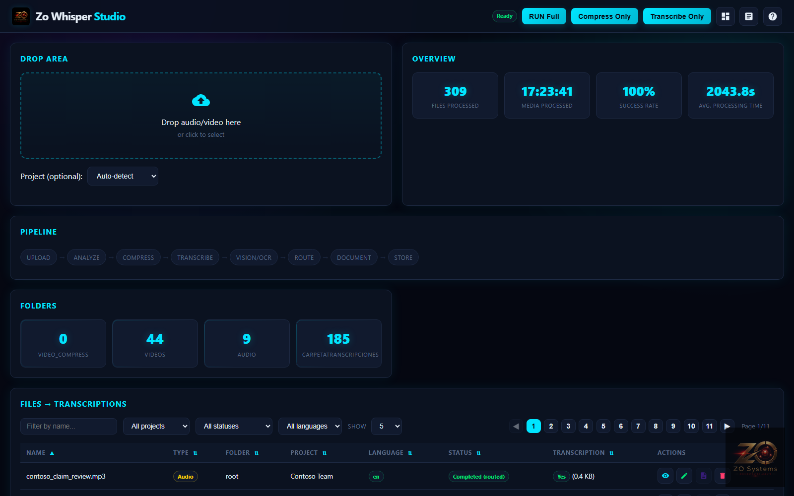
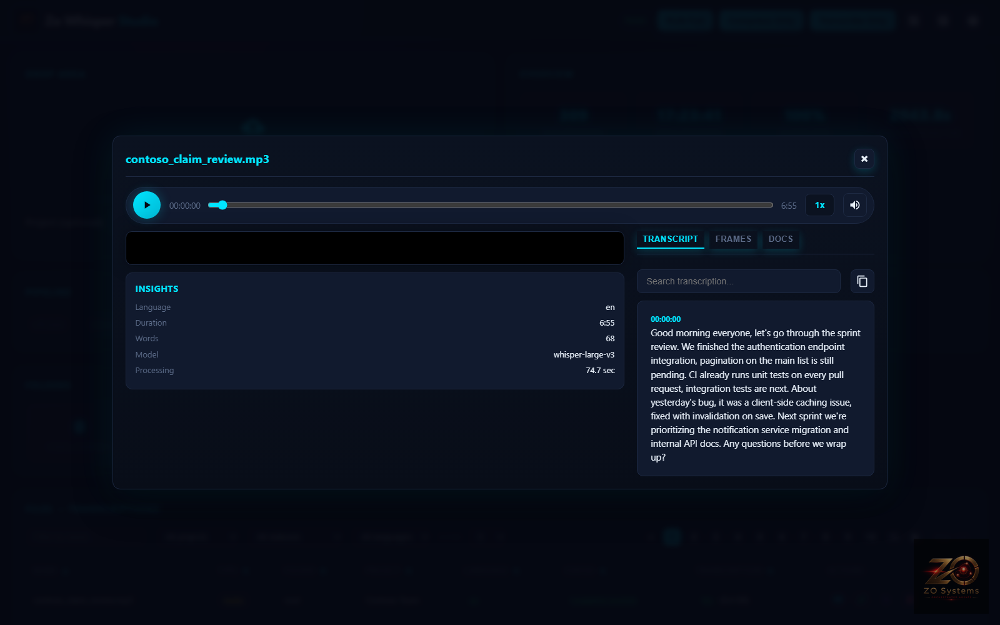
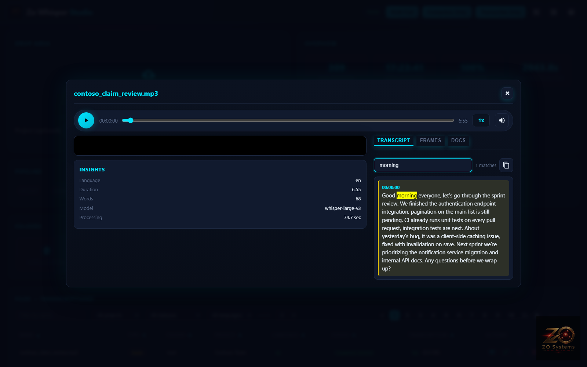
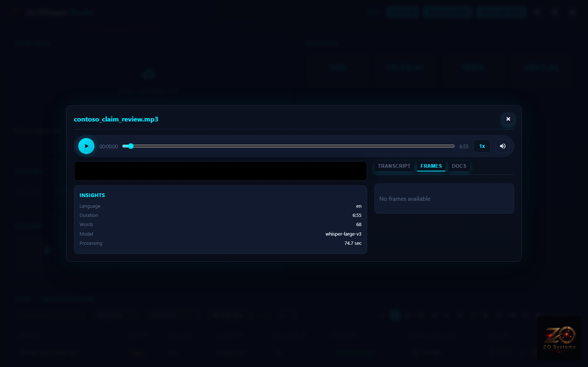
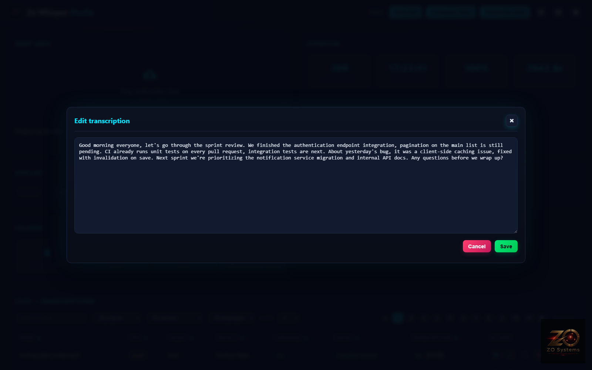
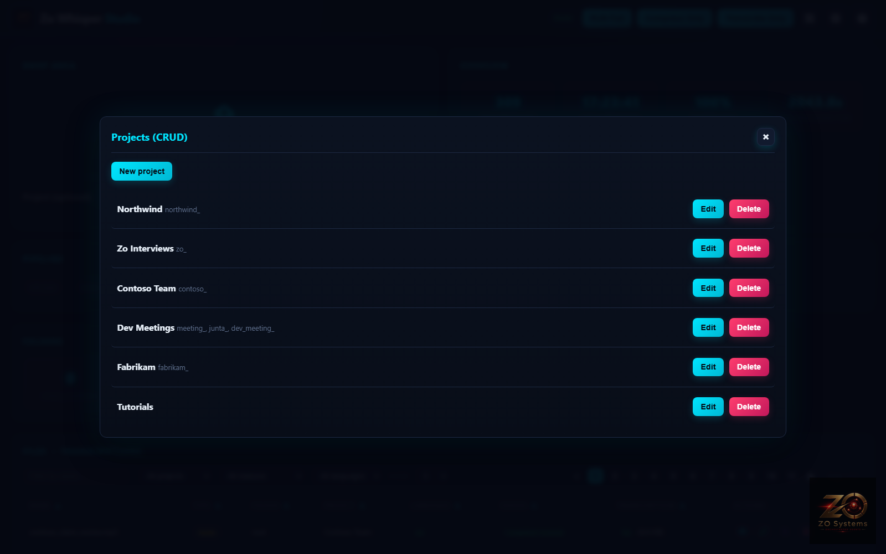
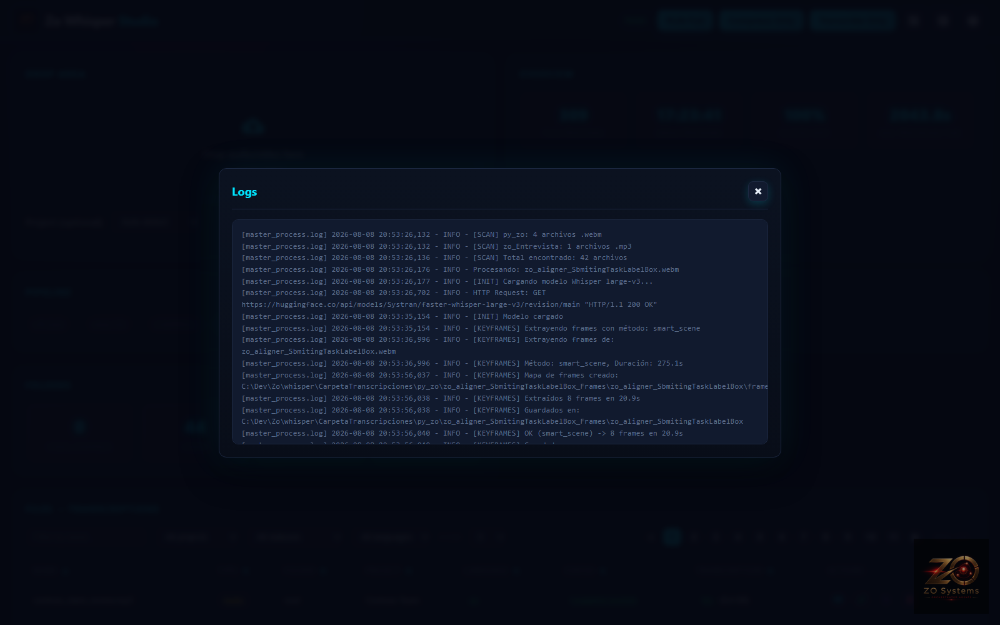
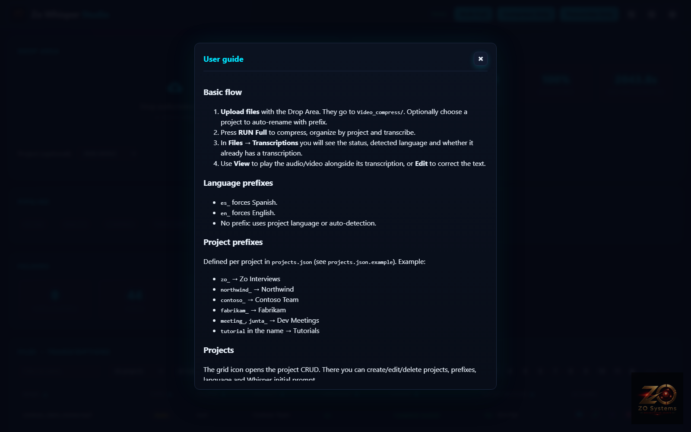

# transcript-pipeline

**Privacy-first local AI transcription & meeting intelligence pipeline.**

Local Whisper transcription, declarative per-project routing, optional
multimodal LLM enrichment behind an explicit opt-in boundary,
security-hardened filesystem access, and fail-closed automated quality
gates.

[](https://github.com/jagzao/zo_whisper2/actions/workflows/dashboard-ci.yml)
[](pyproject.toml)
[](https://github.com/astral-sh/ruff)
[](tests/)
[](LICENSE)

Every meeting, interview, or tutorial gets transcribed, routed, and
optionally summarized automatically based on declarative rules in
`projects.json` — no code changes needed to add a new project.

Daily flow: drop files into `audio/`, `Videos/`, or `Video_compress/` →
`RUN_MAX_QUALITY.bat` → `.txt` + metadata + (optional, opt-in) LLM summary +
keyframes in `CarpetaTranscripciones/`.

## Security & Privacy

- **Local by default.** Media and transcript content stay local for the
  core pipeline — transcription (`faster-whisper`), video/audio processing
  (FFmpeg), OCR (Tesseract), and routing all run on your CPU. Whisper's
  model itself may be downloaded on first use (~3GB, then cached).
- **Dashboard is localhost-only, fail-closed.** `DASHBOARD_HOST` must be a
  loopback address — `Settings.from_env()` raises `ConfigurationError`
  otherwise, no remote mode. Mutating requests (upload/delete/save/run)
  also require a matching Host/Origin and a per-process token
  (`X-Local-Dashboard-Token`, generated fresh at startup, never persisted).
- **No arbitrary filesystem access.** Every dashboard endpoint that touches
  a file goes through `SafePathResolver`, and every response uses opaque
  `media_id`s — no absolute filesystem path is ever returned to or accepted
  from the browser. See `tests/security/` for the traversal/bypass
  regression suite and `docs/adr/0002-safe-filesystem-boundary.md` for the
  design.
- **External LLM calls are off by default** (`ALLOW_EXTERNAL_LLM=false`)
  and blockable per-project (`data_classification: confidential`),
  regardless of the global flag. Every outbound call — summaries, frame
  descriptions, document scanning — routes through one place
  (`AIEnrichmentService`) so that boundary can't be accidentally skipped
  for a subset of call sites — see `PRIVACY.md`.
- **Secret scanning + dependency audit in CI**, fail-closed: if `ruff`,
  `pyright`, `pip-audit`, or the security test suite aren't runnable, the
  gate reports failure, not a silent pass.
- **Synthetic demo data only.** Screenshots and fixtures in this repo are
  generated from `docs/assets/generate_mock_data.py` — no real recordings,
  transcripts, or client names.

Full detail: [`SECURITY.md`](SECURITY.md), [`PRIVACY.md`](PRIVACY.md),
[`docs/THREAT_MODEL.md`](docs/THREAT_MODEL.md),
[`docs/DATA_FLOW.md`](docs/DATA_FLOW.md).

> Use only recordings and materials you are authorized to process. Obtain
> consent where required by applicable law, contract, employer policy, or
> confidentiality agreement — see `PRIVACY.md` (not legal advice).

## Architecture

### Core local pipeline



### Optional external integrations



**Composition root** (`master_processor.py`, `simple_scan.py`, `compress_and_move.py`, `dashboard.py`): thin scripts at the repo root, invoked directly by `RUN_MAX_QUALITY.bat`. They contain no logic — they just import and run the package installed in editable mode. This lets the internals be restructured without ever touching the `.bat` that runs daily.

**`transcript_pipeline`** (`src/`): the actual package. `config.py` resolves the project root by searching upward for `pyproject.toml` (doesn't assume cwd or the location of the file being executed). `settings.py` centralizes all environment-variable configuration into one validated, typed object. `file_tracker.py` gives content-hash idempotency. `projects.py` implements declarative routing plus schema validation for browser-submitted project configs. `security/` is the single filesystem-access boundary. `handlers/` are interchangeable plugins behind a `Protocol`, returning a typed `HandlerResult` (not a bare bool) so a failed handler is never silently marked as completed.

**Handlers as plugins, not if/else.** `MasterProcessor` doesn't know which projects exist: `projects.json` declares match rules (prefix, folder, keyword) and which handler + `output_path` to use. Adding a new project is a JSON entry, not a code branch — see [Extending the system](#extending-the-system).

**No shared-kernel import boundary anymore.** Earlier versions of this pipeline reused four modules from a separate, larger `watcher/` tree (a Docker/Postgres/Redis stack that never ran in the daily flow) via a `sys.path` shim. Those four modules now live inside the installable package itself (`media/`, `postprocessing/`, `llm/`) — see `watcher/README.md` for what's left there and why.

## Tech stack

| Component | Purpose |
|---|---|
| [faster-whisper](https://github.com/SYSTRAN/faster-whisper) (CTranslate2) | Local transcription, CPU, `compute_type=int8`, beam search (`beam_size=10`, `best_of=5`) + VAD |
| Flask | Local dashboard: file browser, transcription editor, pipeline runner — `127.0.0.1`-only by default |
| FFmpeg / ffprobe | H.265 compression, keyframe extraction, video stream detection |
| pytesseract + Pillow/imagehash | Content diff between frames (OCR or perceptual hash) for dev meetings |
| MarkItDown | Converts attached PDF/Word/Excel/images to Markdown for meeting context |
| `transcript_pipeline.llm` | `AIEnrichmentService` (single outbound-AI call point) + provider-agnostic OpenAI-compatible client + `PrivacyGuard` + secret redaction, opt-in only |
| python-dotenv | Configuration source for `Settings.from_env()` (`scan_config.env`) |
| pytest, ruff, pyright, pip-audit, gitleaks | Quality/security/typing/dependency/secret gates — see [Testing](#testing) |
| setuptools (src-layout) | Packaging, `pip install -e .`, entry points |

## Design decisions

- **Idempotency without an external database** (`file_tracker.py`): hash of `size + mtime + first 8KB` of the file, not the whole file — cheap even for large videos. This is an idempotency fingerprint, not a cryptographic integrity guarantee — documented as such.
- **Declarative routing** (`projects.json`): language, Whisper initial prompt, summary prompt, domain-specific vocabulary corrections, filler words to strip, and privacy classification — all per project, without shipping code. Validated (`projects.py::validate_project`) so a malformed dashboard submission can't corrupt routing for every project.
- **Robust root resolution**: `config.PROJECT_ROOT` searches upward for `pyproject.toml` instead of assuming `Path(__file__).parent` (would break once the code lives inside `src/...`) or depending on the cwd the script was launched from.
- **One typed `Settings` object**, not ~15 scattered `os.getenv()` calls: validated once at import, every module imports `SETTINGS` instead of reading the environment itself.
- **Handler contract via `typing.Protocol` + typed result**: the pipeline programs against an interface (`handlers/base.py`), and a handler's success/failure/retryability is an explicit `HandlerResult`, not a bool whose return value used to be silently discarded.
- **Filesystem access through one resolver**: `SafePathResolver` is the only code path allowed to turn user-controlled input into a trusted `Path` — see `docs/adr/0002-safe-filesystem-boundary.md`.
- **Outbound AI policy through one service**: `AIEnrichmentService` (`llm/enrichment.py`) is the only code path allowed to call an LLM provider — it assembles `PrivacyGuard`, `redact_secrets()` (remote providers only), and the `FRAME_DESCRIPTIONS`/`ALLOW_IMAGE_UPLOAD` image policy in one place (video frames, screenshots, and MarkItDown's document-image path alike), so no handler can accidentally skip a check by calling the provider directly.
- **Dashboard is fail-closed localhost-only**: a non-loopback `DASHBOARD_HOST` raises `ConfigurationError` at startup rather than logging a warning and binding anyway; mutating requests require a matching Host/Origin plus a per-process token — see `docs/adr/0005-ai-enrichment-and-local-only-dashboard.md`.

## Project structure

```
whisper/
├── pyproject.toml                 # dependencies, entry points, src-layout, ruff/pyright config
├── requirements.lock.txt          # pinned, reproducible install (regenerate with uv)
├── RUN_MAX_QUALITY.bat            # daily entrypoint (compress + organize + transcribe)
├── projects.json.example          # declarative routing template (real projects.json is gitignored)
├── scan_config.env(.example)      # runtime configuration
├── master_processor.py            # composition root
├── simple_scan.py                 # composition root
├── compress_and_move.py           # composition root
├── dashboard.py                   # composition root
├── src/transcript_pipeline/
│   ├── config.py / settings.py
│   ├── security/                    # SafePathResolver, domain exceptions
│   ├── llm/                         # provider, PrivacyGuard, redaction
│   ├── file_tracker.py / projects.py / language.py / errors.py
│   ├── transcription/processor.py   # SimpleScanProcessor
│   ├── pipeline/master.py           # MasterProcessor
│   ├── media/                       # compressor, keyframe_extractor, utils
│   ├── postprocessing/              # timestamp_formatter
│   ├── handlers/                    # per-project plugins (HandlerResult contract)
│   └── dashboard/                   # Flask + templates
├── tests/                          # unit + tests/security + tests/integration (pytest) + tests/e2e (Playwright)
├── docs/                           # THREAT_MODEL, DATA_FLOW, adr/, screenshots/
├── watcher/                        # experimental, not production — see watcher/README.md
├── deepseek/                       # standalone microservice, not production — see deepseek/README.md
├── audio/ Videos/ Video_compress/  # inputs (gitignored)
└── CarpetaTranscripciones/         # outputs (gitignored)
```

## Installation

Requires Python 3.10+, [FFmpeg](https://ffmpeg.org/) on the `PATH`, and optionally [Tesseract OCR](https://github.com/tesseract-ocr/tesseract) for screen analysis in dev meetings.

```bash
pip install -e ".[dev]"
cp scan_config.env.example scan_config.env
cp projects.json.example projects.json
```

Installs the package in editable mode — `master_processor.py`, `simple_scan.py`, etc. import the code in `src/` directly, no reinstall needed after each change. `scan_config.env` and `projects.json` are local (gitignored) since they usually contain real paths and project names. For an exactly reproducible environment, `pip install -r requirements.lock.txt` instead (see `CONTRIBUTING.md` for regenerating it).

Core install (`pip install -e .`, no extras) only needs faster-whisper,
Flask, and FFmpeg — no LLM client, OCR, or document converter dependency.
Add `[llm]`, `[vision]`, and/or `[documents]` for meeting/tutorial
enrichment features (`[dev]` already includes all of them, for running the
full test suite) — see `CONTRIBUTING.md` for which extra a given feature
needs.

## Configuration

**`scan_config.env`** (copy from `scan_config.env.example`): input paths (Icecream Screen Recorder), keyframe extraction method, `smart_scene` thresholds, Whisper model, dashboard bind address, and the privacy/LLM flags described in [Security & Privacy](#security--privacy) above.

**`projects.json`** (copy from `projects.json.example`): one entry per project. Example:

```json
{
  "name": "Northwind",
  "match": { "folder_contains": ["py_northwind"], "prefix": ["northwind_"] },
  "output_path": "C:/Dev/ClientProjects/Northwind",
  "handler": "client_meeting",
  "data_classification": "confidential",
  "language": "en",
  "initial_prompt": "Meeting of the Northwind development team...",
  "summary_prompt": "You are an executive assistant... extract: 1. Assigned tasks...",
  "corrections": { "Samm": "Sam" }
}
```

`match` decides which files belong to a project; `initial_prompt` reduces Whisper hallucinations with domain vocabulary; `corrections` fixes recurring transcription errors (proper names, technical jargon); `data_classification` (`public`/`internal`/`confidential`) gates whether this project's content can ever reach a remote LLM.

## Usage

```bash
# Full daily flow (H.265 compression + organization + transcription + routing)
RUN_MAX_QUALITY.bat

# Transcription only, no per-project routing
python simple_scan.py

# Local dashboard: file browser, transcription editor, RUN button
python dashboard.py
# → http://localhost:5000
```

| Home | Preview + Insights | Transcript search |
|---|---|---|
|  |  |  |

| Extracted frames | Edit transcription | Projects (CRUD) |
|---|---|---|
|  |  |  |

| Logs | User guide |
|---|---|
|  |  |

*Screenshots use 100% synthetic data — no real client file, name, or transcription appears here. Regenerate with `python docs/assets/generate_mock_data.py` followed by `python scripts/e2e.py` (drives the dashboard with Playwright and re-captures each screen).*

## Testing

```bash
pytest tests/ -v
```

- **Unit**: declarative routing + validation (`test_projects.py`), language detection (`test_language.py`), `FileTracker` idempotency (`test_file_tracker.py`), typed `Settings` (`test_settings.py`), `PrivacyGuard`/redaction (`test_llm_guard_and_redaction.py`), safe import of the optional ML dependency (`test_processor_import_safety.py`) — all pure/isolated, no Whisper model or FFmpeg required.
- **Security** (`tests/security/`): path traversal (relative, absolute Windows/Unix, sibling-prefix, symlink escape), upload validation, malformed project-config rejection, privacy-default assertions.
- **Integration** (`tests/integration/`): the handler → `HandlerResult` → `FileTracker` routing contract, with fakes — no real transcription.
- **E2E** (`tests/e2e/smoke_dashboard.py`): Playwright against a running dashboard with synthetic mock data, driven by `scripts/e2e.py` — not part of the default `pytest` run.

Same gates run in CI (`.github/workflows/dashboard-ci.yml`): lint (ruff) → typing (pyright) → secret scan (gitleaks) → dependency audit (pip-audit) → unit/security/integration tests → E2E, all fail-closed (a missing tool reports failure, not a silent pass — see `scripts/quality.py`/`scripts/security.py`).

## Extending the system

Adding a new project doesn't require touching `MasterProcessor` or `SimpleScanProcessor`:

1. Add an entry to `projects.json` with the `match` rules and (optionally) `output_path`.
2. If it needs its own post-processing (templates, folder structure), create a handler that satisfies `transcript_pipeline.handlers.base.ProjectHandler` (returning `HandlerResult`) and register it in `HANDLER_MAP` (`pipeline/master.py`).
3. Without a handler, the file is still transcribed and routed — it just skips the post-processing logic.

## Known limitations

- **CPU-only by design** (`compute_type=int8`): a cost decision, not an architectural one — runs on any machine without a dedicated GPU, at the cost of speed compared to GPU inference.
- **Single-machine**: no distributed queue or workers — designed for local processing, not multi-user scale. See "What this project deliberately doesn't do" below.
- Whisper's `large-v3` model is downloaded (~3GB) on first use.
- No CSRF-token rotation or session concept — the per-process dashboard
  token is a single static value for the process lifetime, appropriate for
  a single-user localhost tool, not a multi-user auth system.

### What this project deliberately doesn't do

No Kubernetes, no Celery/RabbitMQ, no mandatory Redis or database, no OAuth
login for a localhost-only tool, no microservices for a single-process
local pipeline. This is a single-machine, local-first tool — the absence of
that infrastructure is a design decision, not an oversight (see
`docs/THREAT_MODEL.md` for the trust model that makes it a reasonable one).

## License

[MIT](LICENSE)
