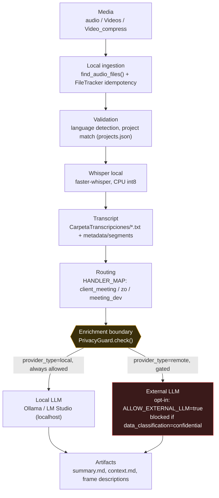

# Data Flow

Where data enters, where it's transformed, and — critically — the one point
where it can leave the machine.

## Where data can leave the machine

**Only one place: the arrow into "External LLM" above.** Everything else —
ingestion, Whisper transcription, keyframe extraction, OCR, routing,
artifact generation — is local filesystem + local compute.

That arrow only fires when all of the following are true (`PrivacyGuard`,
`src/transcript_pipeline/llm/guard.py`):
1. The configured provider's `provider_type` is `remote` (i.e. `LLM_BASE_URL`
   doesn't point at `localhost`/`127.0.0.1`, and `LLM_PROVIDER_TYPE` doesn't
   override it to `local`).
2. `ALLOW_EXTERNAL_LLM=true` (default: `false`).
3. The matched project's `data_classification` is not `confidential`
   (default: `internal`, which is allowed if 1-2 hold).

All of this is enforced through one call point, `AIEnrichmentService`
(`src/transcript_pipeline/llm/enrichment.py`) — every handler and the
tutorial frame-description path route through it rather than assembling
these checks themselves. Text sent through the arrow is passed through
`redact_secrets()` first (best-effort — see `PRIVACY.md` for limits). Frame
images sent for vision analysis are **not** text-redacted (redaction
operates on text, not pixels) — that's why `FRAME_DESCRIPTIONS` (any visual
analysis, local or remote) and `ALLOW_FRAME_UPLOAD` (image bytes reaching a
*remote* provider specifically) are separate, both-default-off flags.

## Local-only paths (never leave the machine)

- `Media → Ingest → Validate → Whisper → Transcript`: fully local, no
  network calls except optionally to download the Whisper model itself
  once (from Hugging Face, on first use, cached afterward — same as any
  local ML tool).
- `Routing`: reads `projects.json` (local file), decides which handler
  processes the result. No network.
- Keyframe extraction (`ffmpeg`) and OCR (`Tesseract`): local subprocess
  calls, no network.
- `Local LLM` path: HTTP to `localhost`/`127.0.0.1` only — doesn't leave
  the machine's network stack.

## Artifacts written to disk

Regardless of whether enrichment ran (and regardless of local vs. remote),
outputs land under `CarpetaTranscripciones/<project>/` or the project's
`output_path`: `transcript.md`/`.txt`, `summary.md`, `context.md`,
`*_metadata.json`, `*_segments.json`, `*_timestamps.txt/.srt`, and
(for tutorial videos) extracted frame images + `frame_mapping.json`.
